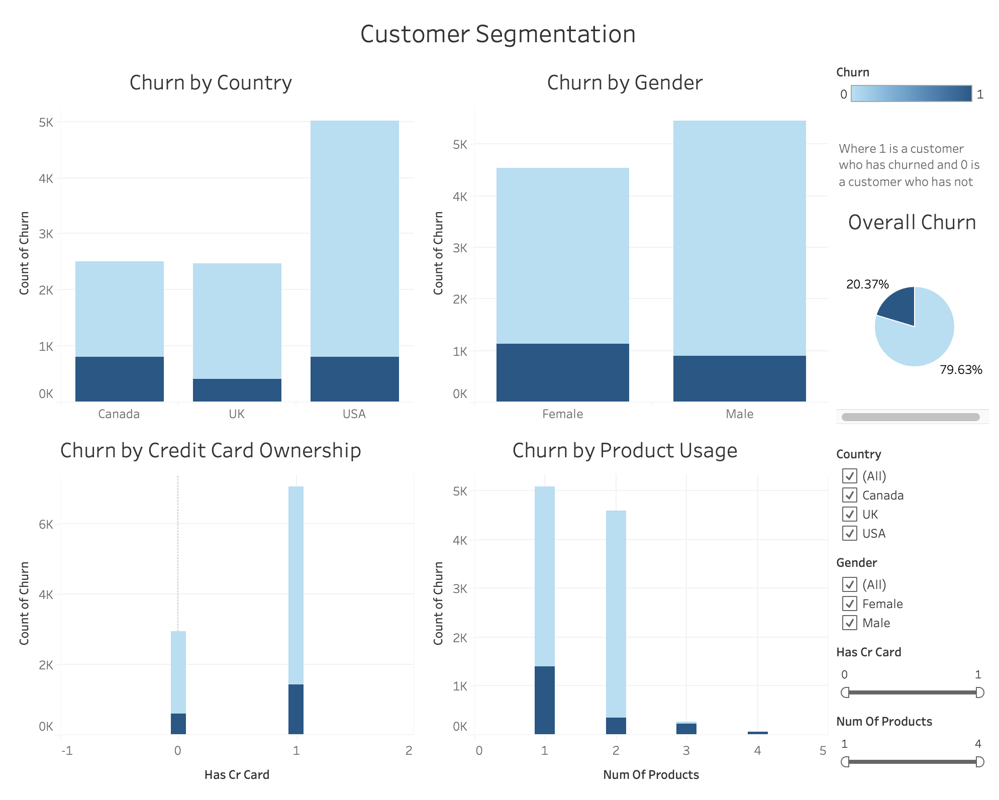

# JPMorgan Chase Bank Churn Analysis

## Table of Contents:
1. [Project Background](#project-background)
2. [Data Visualizations](#data-visualizations)
3. [Building a Model](#building-a-model)
4. [Executive Summary](#executive-summary)
5. [Recommendations](#recommendations)

# Project Background
[Back to Table of Contents](#table-of-contents)

As one of the largest financial institutions in the world, JPMorgan Chase Bank serves millions of customers with a wide range of financial products and services. In such a highly competitive industry, retaining customers is essential for sustaining profitability and maintaining market leadership. Customer churn—the rate at which customers stop using the bank’s products or services—is of significant importance for JPMorgan, as it directly impacts revenue and increases customer acquisition costs.

The problem JPMorgan faces is identifying which customers are at risk of leaving and understanding the factors that drive this churn. With a large customer base, subtle behavioral patterns that could predict future churn can often go unnoticed. I conducted a comprehensive analysis of customer churn, leveraging a dataset that includes key customer information such as age, credit score, salary, product usage, and other features. This project visualizes the data, evaluates these features, and contains a machine learning model that predicts which customers are most likely to churn, uncovering critical business insights. 

By identifying these customers early on, JPMorgan can make data-driven decisions about implementing targeted retention strategies, reducing churn rates, and minimizing customer attrition, thereby increasing customer lifetime value and ensuring long-term growth.

*Disclaimer: The dataset used in this project is a realistic sample created to simulate JPMorgan customer data and does not represent actual customer information.*

# Data Visualizations
[Back to Table of Contents](#table-of-contents)

# Building a Model
[Back to Table of Contents](#table-of-contents)

**Feature Engineering and Data Preparation:**

The feature engineering phase involved developing new variables to better convey the complex customer behaviors and financial patterns that lead to churn. For example, strategic groupings by credit score were created based on risk profiles to more efficiently capture the relationship between credit worthiness and churn probability and dynamic product utilization metrics were employed, such as utilization rates normalized by customer tenure (year-based) and salary-adjusted utilization indicators to account for customer financial capacity. The data preparation phase consisted of: systematic handling of missing values using domain-specific imputation strategies, data encoding frameworks categorical variables to preserve ordinal relationships, and developing reusable data preprocessing functions to ensure pipeline reproducibility.

(img of feature engineering)

**Model Development and Selection:**

The project evaluated eight different machine learning algorithms to identify the optimal approach:
1. LightGBM
2. Gradient Boosting Machine (GBM)
3. CatBoost
4. Random Forest (RF)
5. XGBoost
6. K-Nearest Neighbors (KNN)
7. Logistic Regression (LOGR)
8. Classification and Regression Trees (CART)

(img of model performance and code)

After rigorous testing, LightGBM emerged as the superior model, demonstrating the highest predictive accuracy, excellent handling of complex feature interactions, superior computational efficiency, and strong resistance to overfitting.

**Model Optimization and Validation:**

The optimization phase encompassed: hyperparameter tuning using cross-validation, development of a confusion matrix to assess prediction accuracy across different customer segments, ROC curve analysis to optimize the trade-off between sensitivity and specificity.

(include img of all the above)

**Key Performance Metrics:**

The final model achieved:

AUC-ROC score of [Insert score]
Precision: [Insert]
Recall: [Insert]
F1-Score: [Insert]

These results indicate strong predictive capability across different customer segments, enabling proactive retention strategies for high-risk customers.

# Executive Summary
[Back to Table of Contents](#table-of-contents)

The churn analysis for JP Morgan Chase Bank revealed key insights into customer behavior, particularly regarding product usage, age demographics, and credit scores.

1. **Product Usage and Churn:** A significant finding was that customers using products 3 and 4 exhibited the highest churn rates. Notably, all customers utilizing product 4 had discontinued their relationship with the bank, signaling a critical area for further investigation and potential service improvement.

2. **Age and Churn Propensity:** Customers aged 40 to 65 were found to have a higher likelihood of leaving the bank, suggesting that this demographic may require targeted retention strategies.

3. **Credit Score Impact:** Customers with credit scores below 450 showed markedly high churn rates. This trend highlights the potential influence of financial stability on customer retention and emphasizes the need for tailored financial products or support for this segment.

4. **Modeling and Prediction:** To predict churn, eight classification models were employed. The LightGBM model achieved the highest performance in terms of both accuracy and cross-validation scores, making it the most reliable model for churn prediction in this analysis. Detailed performance metrics were calculated and visualized for all models, facilitating a comprehensive comparison.

# Recommendations
[Back to Table of Contents](#table-of-contents)

Based on the uncovered insights, the following recommendations have been provided:

1. **Investigate Product 3 and 4 Usage:** Conduct a detailed review of products 3 and 4 to understand the specific pain points leading to high churn. This may involve gathering customer feedback, analyzing product features, and assessing customer support interactions. The questions we are looking to answer include: What specific aspects of these products (especially 4) are leading to churn? Are there patterns in how long customers stay with these products before churning? How do these products compare with competitors’ offerings?

2. **Targeted Retention Strategy for Age Group 40-65:** Develop retention programs specifically for customers aged 40 to 65. Aside from the fact that they are churning, maintaining them is paramount because they are valuable customers, often with higher income than younger customers. Additionally, losing at this age hurts the lifetime value (LTV) of all JPMorgan's customers below the age of 40. Potential strategies to tackle this iisue could include tailored financial advisory services, personalized product recommendations, or loyalty incentives aimed at addressing the unique needs and challenges of this demographic.

3. **Focus on Customers with Low Credit Scores:** Implement support initiatives for customers with credit scores below 450, such as offering credit counseling, financial education resources, or flexible financial products. These measures could help reduce churn among this at-risk group by improving their financial stability and engagement with the bank. Alternatively, the company could create a cost-benefit analysis to evaluate whether these customers are worth keeping, espeically due to the concerns regarding their LTV.

4. **Refine Predictive Modeling and Ongoing Monitoring:** Continuously monitor the performance of the LightGBM churn prediction model and integrate it into customer retention workflows. Automating the detection of at-risk customers and feeding this information to relevant teams can enable proactive interventions. Furthermore, JPMorgan's data science team must explore these questions: Can additional features, such as transaction behavior or customer support interactions, improve the accuracy of churn predictions? How can we fine-tune thresholds for intervention based on churn risk scores? 

